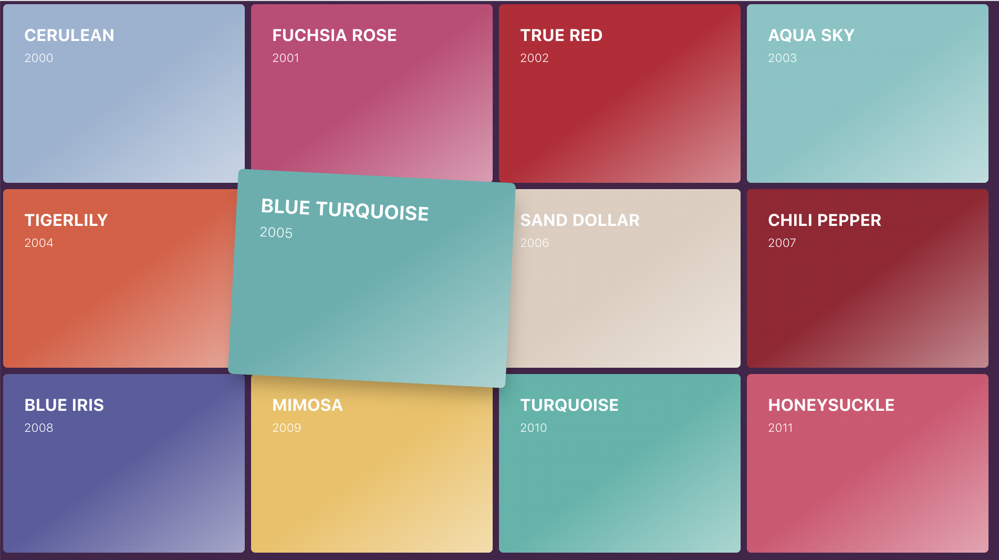
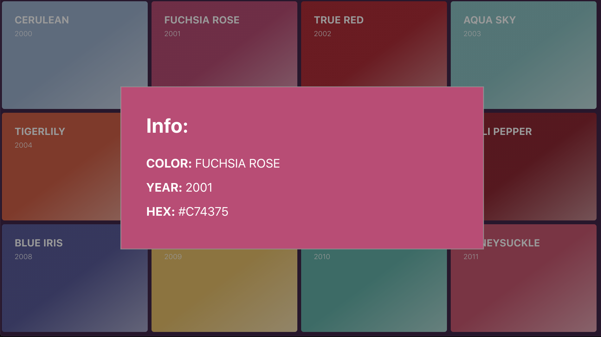

# Magic List Of Colors
## Colorful animated cardboard with modal.

The cardboard is built with React and CSS (functional components and hooks).
The cards are generated based on the data received from api. 
Cards are animated using CSS. The modal with the card's description opens when clicking on the card. 
To close the modal, click on the outside area.

## [DEMO](https://tymoxx.github.io/Magic-List-Of-Colors)

---
This project was bootstrapped with [Create React App](https://github.com/facebook/create-react-app).

## Available Scripts

From the project directory, you can run:
#### `yarn start`

Open [http://localhost:3000](http://localhost:3000) to view it in the browser.

#### `yarn test`

#### `yarn build`

To publish to Github Pages run:
#### `yarn deploy`
